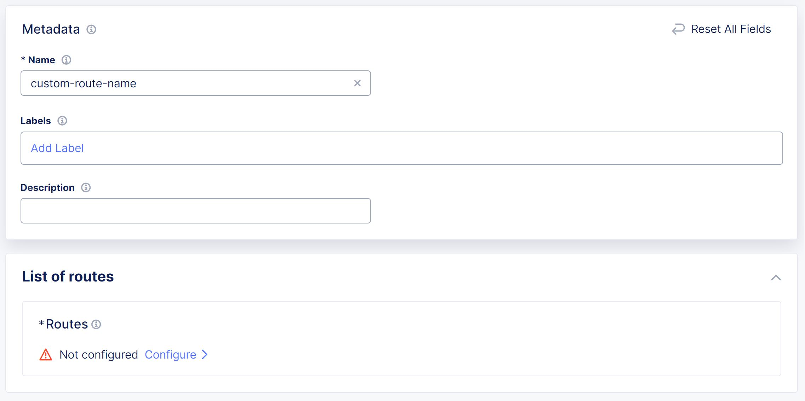
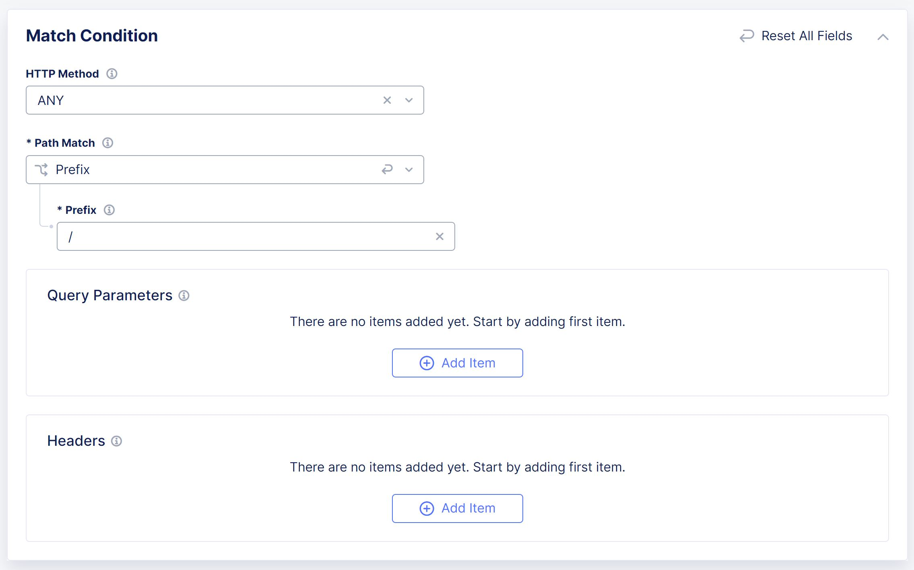
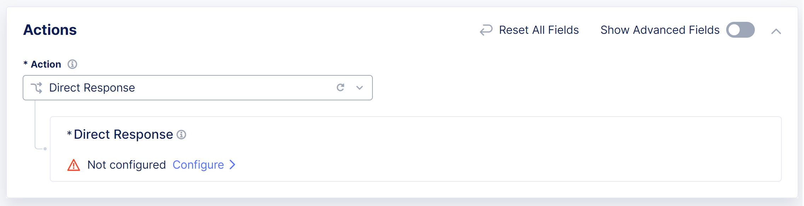
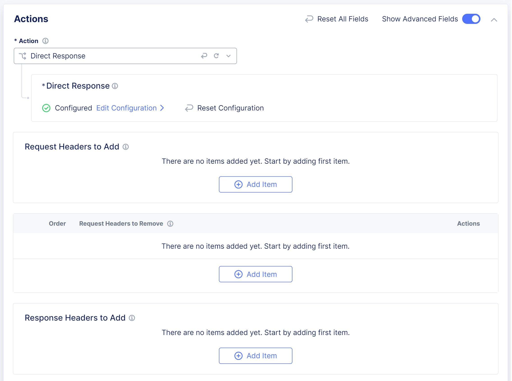
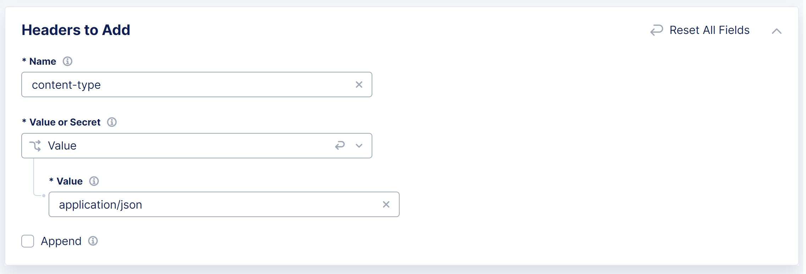
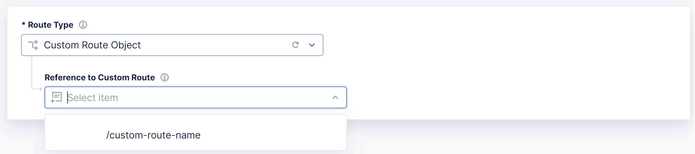

# F5 Distributed Cloud - Simple API Discovery

Simple method for providing API Discovery via Distributed Cloud for APIs that are not proxied by Distributed Cloud.

This approach doesn't require an actual service response, only request traffic.

## Table of Contents
1. [Flow](#flow)
2. [Outcome](#outcome)
3. [Outcome Example](#outcome-example)
4. [Limitations](#limitations)
5. [Requirements](#requirements)
6. [Guide](#guide)
7. [Custom Route Template](#custom-route-template)
8. [Load Balancer Templates](#load-balancer-templates) 

## Flow

## Outcome

- Path Discovery (Leaf Creation)

- Request Sensitive Data Detection (PUT, POST)

_Note - Sensitive Data Detection requires request format of JSON_

## Outcome Example

Path Discovery (Leaf Creation)

Request Sensitive Data Detection (PUT, POST)

## Limitations

- No Response Sensitive Data Detection

- No Authentication Detection

- No Performance Statistics

_Note - Limitation(s) are not a result of platform capability, but an outcome of not having a proper service response_

## Requirements

- HTTP(S) Request Traffic

- Distributed Cloud Tenant

  -	Load Balancer

  -	Route

  -	API Discovery

## Guide

_Under Multi-Cloud App Connect > Manage > Virtual Host > Routes_

Create a Custom Route, Configure under Routes

Add Route Match Condition

Add Route Actions, Direct Response, Configure

Update Response Body (JSON Format)

[response body content](response_body.json)

Expand Advanced Fields, Response Header to Add

Update Response Header

Save and Exit

-------------------------------------------------------------------

_Under Multi-Cloud App Connect > Manage > Load Balancers > HTTP Load Balancers_

Created a HTTP Load Balancer, specifying your desired configuration
-	Load Balancer Name
-	Domains
-	Load Balancer Type

_Additional References @ [F5 Tech Docs - HTTP Load Balacer](https://docs.cloud.f5.com/docs/how-to/app-networking/http-load-balancer)_

Add a Route, Configuration under Routes

Attach Custom Route

Enable API Discovery

Save and Exit

## Custom Route Template

Custom Route Direct Response

[custom_route_response](custom_route_response.json)

## Load Balancer Templates

HTTP without Managed DNS

[lb_template_http](lb_template_http.json)

HTTP with Managed DNS

[lb_template_http_dns](lb_template_http_dns.json)

HTTPS with Auto Certificate

[lb_template_https_auto_cert](lb_template_https_auto_cert.json)

HTTPS with Custom Certificate (Multiple Certificate)

[lb_template_https_multi_cert](lb_template_https_multi_cert.json)